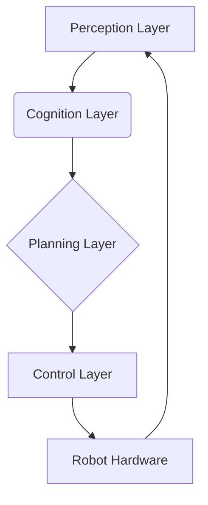

# Chapter 6: Capstone - Simple AI-Robot Pipeline

This chapter guides you through building a complete AI-robot pipeline, integrating perception, cognition, planning, and control using ROS 2, OpenCV, and MoveIt.

## 1. Learning Objectives

Upon completing this chapter, students will be able to:

- Design an end-to-end AI-robot pipeline from perception to action
- Integrate ROS 2, simulation, and AI models in a cohesive system
- Apply best practices for modular robot software architecture
- Deploy and test a complete robotic application

## 2. Introduction

An AI-robot pipeline is a sequence of interconnected modules that enable an autonomous robot to perceive its environment, understand situations, make decisions, plan actions, and execute them. This pipeline is crucial for robots performing complex tasks, as it provides a structured way to integrate different AI and robotics components into a single, cohesive system.

Autonomous systems rely on the seamless interaction of several layers:

- **Perception**: The robot's ability to sense and interpret its surroundings using various sensors (cameras, LiDAR, etc.).
- **Cognition**: The processing of perceived information to understand the current state, make high-level decisions, and determine the overall task strategy.
- **Planning**: The generation of detailed, collision-free paths and trajectories for the robot's movements, considering its physical constraints and the environment.
- **Control**: The execution of these plans by sending precise commands to the robot's actuators to achieve the desired motion.

A well-designed pipeline ensures:

- **Cohesion**: Different functionalities (vision, decision-making, motion) work together seamlessly.
- **Modularity**: Components can be developed, tested, and replaced independently, fostering reusability and maintainability.
- **Scalability**: New capabilities can be added without overhauling the entire system, allowing for incremental development.
- **Robustness**: The system can handle uncertainties, sensor noise, unexpected events, and minor failures, leading to more reliable operation.

## 3. Core Concepts

### Layered Architecture: Perception → Cognition → Planning → Control

The AI-robot pipeline is typically broken down into distinct layers, each handling a specific aspect of robot autonomy:



- **Perception Layer**: Gathers and interprets sensor data to understand the environment (e.g., object detection, localization, mapping). It transforms raw sensor readings into meaningful information.
- **Cognition Layer**: Processes perceived information, makes high-level decisions, and plans tasks. This layer often involves AI models for reasoning, task sequencing, and goal management.
- **Planning Layer**: Generates detailed motion plans and collision-free trajectories for the robot's actions, considering kinematic and dynamic constraints. This can include path planning for mobile robots or joint-space trajectory generation for manipulators.
- **Control Layer**: Translates motion plans into low-level actuator commands and executes them. This layer ensures the robot follows the planned trajectories accurately and safely.

### Design Principles

- **Modularity**: Each layer and component should be self-contained with well-defined interfaces (e.g., ROS 2 topics, services, actions). This allows for easier development, testing, and debugging. Modularity promotes code reuse and simplifies system upgrades.
- **Robustness**: The pipeline should be resilient to noisy sensor data, unexpected environmental changes, and minor hardware failures. Incorporating error handling, state estimation, and fallback mechanisms is crucial.
- **Safety**: Paramount for real-world robotic applications. The pipeline must incorporate safety checks, collision avoidance, emergency stop mechanisms, and adhere to safety standards to prevent harm to humans or damage to the robot and its surroundings.
- **Testability**: Each component and the entire pipeline should be easily testable, both in simulation and on real hardware. Unit tests for individual modules and integration tests for the whole system are essential for verifying functionality and performance.

### Perception Layer: Sensor Data Processing and Object Detection

The perception layer uses sensors like cameras to detect objects in the robot's environment. We'll use OpenCV, a widely used computer vision library, for basic object detection.

**Example: Simple Color-Based Object Detection (Python + OpenCV + ROS 2)**

This ROS 2 Python node subscribes to an image topic, detects blue objects using OpenCV, draws bounding boxes, and publishes the processed image.

```python
import rclpy
from rclpy.node import Node
from sensor_msgs.msg import Image
from std_msgs.msg import String # For publishing simple detection results
from cv_bridge import CvBridge
import cv2
import numpy as np

class ObjectDetector(Node):
    def __init__(self):
        super().__init__('object_detector')
        # Subscribe to the raw camera image topic
        self.subscription = self.create_subscription(
            Image,
            '/camera/image_raw',  # Adjust topic name as per your simulation/robot setup
            self.image_callback,
            10)
        # Publish the image with detected objects
        self.publisher = self.create_publisher(Image, 'object_detection/image_processed', 10)
        # Publisher for object detection results (e.g., bounding boxes, class)
        # For simplicity, we'll just log here; in a real system, publish a custom message
        self.result_publisher = self.create_publisher(String, 'object_detection/result', 10)
        self.bridge = CvBridge()
        self.get_logger().info("Object Detector Node Started and ready to process images.")

    def image_callback(self, msg):
        try:
            # Convert ROS Image message to OpenCV image
            cv_image = self.bridge.imgmsg_to_cv2(msg, 'bgr8')
        except Exception as e:
            self.get_logger().error(f"Error converting image: {e}")
            return

        hsv = cv2.cvtColor(cv_image, cv2.COLOR_BGR2HSV)

        # Define range for a specific color (e.g., blue) in HSV
        # These values might need tuning based on lighting conditions
        lower_blue = np.array([100, 150, 0])
        upper_blue = np.array([140, 255, 255])

        # Threshold the HSV image to get only blue colors
        mask = cv2.inRange(hsv, lower_blue, upper_blue)

        # Apply morphological operations to remove small noise and close gaps
        mask = cv2.erode(mask, None, iterations=2)
        mask = cv2.dilate(mask, None, iterations=2)

        # Find contours in the mask
        contours, _ = cv2.findContours(mask, cv2.RETR_EXTERNAL, cv2.CHAIN_APPROX_SIMPLE)

        detected_objects_count = 0
        # Iterate over detected contours and draw bounding boxes
        for contour in contours:
            # Filter small objects by area to reduce false positives
            if cv2.contourArea(contour) > 1500: # Threshold area in pixels
                x, y, w, h = cv2.boundingRect(contour)
                cv2.rectangle(cv_image, (x, y), (x + w, y + h), (255, 0, 0), 2) # Draw blue rectangle
                self.get_logger().info(f"Detected object at: x={x}, y={y}, width={w}, height={h}")
                detected_objects_count += 1

        # Publish a simple result message
        result_msg = String()
        result_msg.data = f"Detected {detected_objects_count} objects."
        self.result_publisher.publish(result_msg)

        # Publish the image with detections
        try:
            self.publisher.publish(self.bridge.cv2_to_imgmsg(cv_image, 'bgr8'))
        except Exception as e:
            self.get_logger().error(f"Error converting image for publishing: {e}")

def main(args=None):
    rclpy.init(args=args)
    object_detector = ObjectDetector()
    rclpy.spin(object_detector)
    object_detector.destroy_node()
    rclpy.shutdown()

if __name__ == '__main__':
    main()
```

### Cognition Layer: Task Planning and Decision Making

The cognition layer takes the perceived information and decides what high-level actions the robot should take. For a simple pick-and-place task, this involves deciding if an object is present, its location, and the target placement area.

**Example: Simple Pick-and-Place Decision Logic (Python + ROS 2)**

This node subscribes to object detection results and publishes a command for the robot to perform a pick-and-place operation if an object is detected.

```python
import rclpy
from rclpy.node import Node
from std_msgs.msg import String # Using String for simplicity; ideally a custom message with object pose

class DecisionMaker(Node):
    def __init__(self):
        super().__init__('decision_maker')
        # Subscribe to object detection results (from Perception Layer)
        self.subscription = self.create_subscription(
            String, # Replace with a custom ObjectDetectionResult message type for real applications
            '/object_detection/result',
            self.object_detection_callback,
            10)
        # Publish commands to the Planning Layer
        self.publisher = self.create_publisher(String, 'robot_task/command', 10)
        self.object_detected = False
        self.object_info = {} # Store object pose, class, etc.
        self.get_logger().info("Decision Maker Node Started. Awaiting object detection results.")

    def object_detection_callback(self, msg):
        # In a real scenario, parse a custom ObjectDetectionResult message
        # For this example, we'll simulate object detection based on the string content
        if "Detected 1 objects." in msg.data: # Simple check for detected objects
            self.object_detected = True
            # Simulate object position (e.g., from image processing or depth camera)
            self.object_info = {'pose': {'x': 0.5, 'y': 0.1, 'z': 0.05}} # Example pose
            self.get_logger().info("Object detected from perception. Deciding next action...")
            self.decide_action()
        else:
            self.object_detected = False
            self.object_info = {}
            self.get_logger().info("No objects detected. Waiting for perception data.")

    def decide_action(self):
        if self.object_detected and self.object_info:
            command_msg = String()
            command_msg.data = f"pick_and_place_at_x_{self.object_info['pose']['x']}_y_{self.object_info['pose']['y']}_z_{self.object_info['pose']['z']}"
            self.publisher.publish(command_msg)
            self.get_logger().info(f"Published pick_and_place command: {command_msg.data}")
            # Reset detection state to avoid repeatedly sending the same command
            self.object_detected = False
        else:
            self.get_logger().info("No valid object info to initiate pick-and-place. Waiting.")

def main(args=None):
    rclpy.init(args=args)
    decision_maker = DecisionMaker()
    rclpy.spin(decision_maker)
    decision_maker.destroy_node()
    rclpy.shutdown()

if __name__ == '__main__':
    main()
```

### Planning Layer: Motion Planning and Trajectory Generation

The planning layer generates collision-free trajectories for the robot's manipulators or mobile base. MoveIt 2 is a powerful framework for this, often used with ROS 2. It integrates various planning algorithms, robot models, and collision checking capabilities.

**Example: Simple MoveIt 2 Motion Planning (Python + ROS 2)**

This example demonstrates how to plan a simple joint space goal for a robot arm using MoveIt 2. It assumes MoveIt 2 is configured for your robot.

```python
import rclpy
from rclpy.node import Node
import moveit_commander
import sys
import geometry_msgs.msg
from std_msgs.msg import String
from launch.substitutions import Command # Import for using xacro in robot_description

class MotionPlanner(Node):
    def __init__(self):
        super().__init__('motion_planner')
        self.get_logger().info("Initializing MoveIt Commander...")

        # Initialize MoveIt Commander; it requires a rclcpp::init call which roscpp_initialize handles
        moveit_commander.roscpp_initialize(sys.argv)
        self.robot = moveit_commander.RobotCommander(node_name='moveit_commander_node', cli_args=sys.argv)
        self.scene = moveit_commander.PlanningSceneInterface(synchronous=True)

        # Define the planning group (e.g., "arm", "manipulator")
        self.group_name = "ur_manipulator" # Replace with your robot's MoveIt planning group name
        self.move_group = moveit_commander.MoveGroupCommander(self.group_name, node_name='moveit_commander_node')

        self.get_logger().info("MoveIt Commander Initialized. Robot group: " + self.move_group.get_name())

        # Subscriber to trigger planning from Cognition Layer
        self.subscription = self.create_subscription(
            String,
            '/robot_task/command',
            self.command_callback,
            10)

        # Publisher for planned trajectory command (to Control Layer)
        self.trajectory_publisher = self.create_publisher(String, '/motion_planner/trajectory_command', 10)

        self.get_logger().info("Motion Planner Node Started. Waiting for commands.")

    def command_callback(self, msg):
        if "pick_and_place" in msg.data:
            # Parse target pose from the command message (simplified)
            # For a real system, use a dedicated message type for pick-and-place targets
            try:
                parts = msg.data.split('_')
                x_idx = parts.index('at') + 2
                y_idx = parts.index('y') + 1
                z_idx = parts.index('z') + 1
                target_x = float(parts[x_idx])
                target_y = float(parts[y_idx])
                target_z = float(parts[z_idx])
                self.get_logger().info(f"Received pick_and_place command for target: ({target_x}, {target_y}, {target_z})")
                self.plan_and_execute_pick_place(target_x, target_y, target_z)
            except (ValueError, IndexError) as e:
                self.get_logger().error(f"Failed to parse pick-and-place command: {e}")
        else:
            self.get_logger().warn(f"Unknown command received: {msg.data}")

    def plan_and_execute_pick_place(self, target_x, target_y, target_z):
        self.get_logger().info("Planning pick and place motion...")

        # 1. Go to a pre-grasp approach position
        pose_goal = geometry_msgs.msg.Pose()
        pose_goal.orientation.w = 1.0 # No rotation, or specify an appropriate orientation
        pose_goal.position.x = target_x
        pose_goal.position.y = target_y
        pose_goal.position.z = target_z + 0.1 # Approach from above

        self.move_group.set_pose_target(pose_goal)
        plan_approach = self.move_group.plan()

        if plan_approach[0]:
            self.get_logger().info("Approach planning successful! Executing approach motion...")
            self.move_group.execute(plan_approach[1], wait=True)
            self.get_logger().info("Approach motion executed.")

            # 2. Go to grasp position (at the object)
            pose_goal.position.z = target_z # Move down to grasp
            self.move_group.set_pose_target(pose_goal)
            plan_grasp = self.move_group.plan()

            if plan_grasp[0]:
                self.get_logger().info("Grasp planning successful! Executing grasp motion...")
                self.move_group.execute(plan_grasp[1], wait=True)
                self.get_logger().info("Grasp motion executed. (Simulate gripper close here)")

                # Publish command to control layer to close gripper
                gripper_cmd_msg = String()
                gripper_cmd_msg.data = "close_gripper"
                self.trajectory_publisher.publish(gripper_cmd_msg)

                # 3. Lift object
                pose_goal.position.z = target_z + 0.2 # Lift object
                self.move_group.set_pose_target(pose_goal)
                plan_lift = self.move_group.plan()

                if plan_lift[0]:
                    self.get_logger().info("Lift planning successful! Executing lift motion...")
                    self.move_group.execute(plan_lift[1], wait=True)
                    self.get_logger().info("Lift motion executed.")

                    # 4. Move to place position (example: a different location)
                    place_pose = geometry_msgs.msg.Pose()
                    place_pose.orientation.w = 1.0
                    place_pose.position.x = -0.5 # Example place X
                    place_pose.position.y = 0.3 # Example place Y
                    place_pose.position.z = 0.2 # Example place Z (above surface)

                    self.move_group.set_pose_target(place_pose)
                    plan_place_approach = self.move_group.plan()

                    if plan_place_approach[0]:
                        self.get_logger().info("Place approach planning successful! Executing place approach motion...")
                        self.move_group.execute(plan_place_approach[1], wait=True)
                        self.get_logger().info("Place approach motion executed.")

                        # 5. Lower to place position
                        place_pose.position.z = 0.05 # Actual place Z
                        self.move_group.set_pose_target(place_pose)
                        plan_place = self.move_group.plan()

                        if plan_place[0]:
                            self.get_logger().info("Place planning successful! Executing place motion...")
                            self.move_group.execute(plan_place[1], wait=True)
                            self.get_logger().info("Place motion executed. (Simulate gripper open here)")

                            # Publish command to control layer to open gripper
                            gripper_cmd_msg.data = "open_gripper"
                            self.trajectory_publisher.publish(gripper_cmd_msg)

                            # 6. Retreat from place position
                            place_pose.position.z = 0.2 # Retreat
                            self.move_group.set_pose_target(place_pose)
                            plan_retreat = self.move_group.plan()

                            if plan_retreat[0]:
                                self.get_logger().info("Retreat planning successful! Executing retreat motion...")
                                self.move_group.execute(plan_retreat[1], wait=True)
                                self.get_logger().info("Retreat motion executed. Pick and place sequence completed.")
                                # Signal Control Layer to indicate task completion
                                task_complete_msg = String()
                                task_complete_msg.data = "pick_and_place_completed"
                                self.trajectory_publisher.publish(task_complete_msg)
                            else:
                                self.get_logger().warn("Retreat motion planning failed!")
                        else:
                            self.get_logger().warn("Place motion planning failed!")
                    else:
                        self.get_logger().warn("Place approach motion planning failed!")
                else:
                    self.get_logger().warn("Lift motion planning failed!")
            else:
                self.get_logger().warn("Grasp motion planning failed!")
        else:
            self.get_logger().warn("Approach motion planning failed!")

        self.move_group.stop()
        self.move_group.clear_pose_targets()

    def shutdown(self):
        moveit_commander.roscpp_shutdown()
        self.get_logger().info("MoveIt Commander Shutdown.")

def main(args=None):
    rclpy.init(args=args)
    motion_planner = MotionPlanner()
    try:
        rclpy.spin(motion_planner)
    except KeyboardInterrupt:
        pass
    finally:
        motion_planner.shutdown()
        motion_planner.destroy_node()
        rclpy.shutdown()

if __name__ == '__main__':
    main()
```

### Control Layer: Executing Joint Trajectories and Actuator Commands

The control layer takes the planned trajectories and translates them into actual commands for the robot's actuators (motors, grippers, etc.). This often involves publishing messages to specific ROS 2 topics that are consumed by robot controllers.

**Example: Simple ROS 2 Joint Trajectory and Gripper Command Publisher (Python)**

This node subscribes to commands from the Planning Layer and publishes `JointTrajectory` messages to control the robot's joints and `String` messages for gripper control.

```python
import rclpy
from rclpy.node import Node
from trajectory_msgs.msg import JointTrajectory, JointTrajectoryPoint
from std_msgs.msg import String
import time # For simulating delays

class JointCommander(Node):
    def __init__(self):
        super().__init__('joint_commander')
        # Publisher for joint trajectory commands (to robot hardware interface)
        self.joint_trajectory_publisher = self.create_publisher(
            JointTrajectory,
            '/joint_trajectory_controller/joint_trajectory', # Common topic for joint controllers
            10)
        # Publisher for gripper commands
        self.gripper_publisher = self.create_publisher(String, '/gripper/command', 10)

        # Subscriber for commands from the Planning Layer
        self.command_subscription = self.create_subscription(
            String,
            '/motion_planner/trajectory_command',
            self.trajectory_command_callback,
            10)

        self.get_logger().info("Joint Commander Node Started. Ready to execute trajectories.")

    def trajectory_command_callback(self, msg):
        if msg.data == "execute_trajectory":
            self.execute_example_trajectory()
        elif msg.data == "close_gripper":
            self.publish_gripper_command("close")
        elif msg.data == "open_gripper":
            self.publish_gripper_command("open")
        elif msg.data == "pick_and_place_completed":
            self.get_logger().info("Received pick-and-place completed signal from Planning Layer.")
        else:
            self.get_logger().warn(f"Unknown command received: {msg.data}")

    def publish_gripper_command(self, command):
        gripper_msg = String()
        gripper_msg.data = command
        self.gripper_publisher.publish(gripper_msg)
        self.get_logger().info(f"Published gripper command: {command}")
        time.sleep(1) # Simulate gripper action time

    def execute_example_trajectory(self):
        self.get_logger().info("Executing example trajectory...")

        trajectory_msg = JointTrajectory()
        # IMPORTANT: Replace with your robot's actual joint names
        trajectory_msg.joint_names = ['joint1', 'joint2', 'joint3', 'joint4', 'joint5', 'joint6']

        point1 = JointTrajectoryPoint()
        point1.positions = [0.0, 0.0, 0.0, 0.0, 0.0, 0.0] # Home position
        point1.time_from_start.sec = 1
        point1.time_from_start.nanosec = 0

        point2 = JointTrajectoryPoint()
        point2.positions = [0.5, -0.5, 0.5, -0.5, 0.5, 0.0] # Intermediate position
        point2.time_from_start.sec = 3
        point2.time_from_start.nanosec = 0

        point3 = JointTrajectoryPoint()
        point3.positions = [1.0, -1.0, 1.0, -1.0, 1.0, 0.0] # Target position
        point3.time_from_start.sec = 5
        point3.time_from_start.nanosec = 0

        trajectory_msg.points.append(point1)
        trajectory_msg.points.append(point2)
        trajectory_msg.points.append(point3)

        self.joint_trajectory_publisher.publish(trajectory_msg)
        self.get_logger().info("Published example joint trajectory.")

def main(args=None):
    rclpy.init(args=args)
    joint_commander = JointCommander()
    rclpy.spin(joint_commander)
    joint_commander.destroy_node()
    rclpy.shutdown()

if __name__ == '__main__':
    main()
```

## 4. Integration: ROS 2 Launch File Example

A ROS 2 launch file in Python allows you to start multiple nodes and configure their parameters, making it easy to deploy the entire pipeline. This example assumes you have packaged your nodes (e.g., `object_detector_node`, `decision_maker_node`, `motion_planner_node`, `joint_commander_node`) within ROS 2 packages.

**Example: `pipeline_launch.py`**

This launch file starts all the necessary nodes for the AI-robot pipeline and optionally includes a Gazebo simulation and robot state publishers.

```python
from launch import LaunchDescription
from launch_ros.actions import Node
from launch.actions import IncludeLaunchDescription, DeclareLaunchArgument
from launch.launch_description_sources import PythonLaunchDescriptionSource
from ament_index_python.packages import get_package_share_directory
from launch.substitutions import LaunchConfiguration, Command # Import Command for xacro processing
from launch.conditions import IfCondition # Import IfCondition for conditional launching
import os

def generate_launch_description():
    # Declare launch arguments
    use_sim_time = DeclareLaunchArgument(
        'use_sim_time',
        default_value='true',
        description='Use simulation (Gazebo) clock if true')

    start_gazebo = DeclareLaunchArgument(
        'start_gazebo',
        default_value='true',
        description='Start Gazebo simulation if true')

    # Paths to your robot's description package (e.g., for URDF, MoveIt config)
    # REPLACE 'your_robot_description' and 'your_moveit_config' with actual package names
    robot_description_pkg_path = get_package_share_directory('your_robot_description')
    moveit_config_pkg_path = get_package_share_directory('your_moveit_config')

    # Example: Path to a simple Gazebo world file
    gazebo_world_path = os.path.join(robot_description_pkg_path, 'worlds', 'simple_room.world')

    # Gazebo launch file
    gazebo_launch_file = os.path.join(get_package_share_directory('gazebo_ros'), 'launch', 'gazebo.launch.py')

    # Robot Description (URDF/XACRO)
    # Ensure your_robot.urdf.xacro or your_robot.urdf is correctly located
    xacro_file = os.path.join(robot_description_pkg_path, 'urdf', 'your_robot.urdf.xacro')
    robot_description_content = Command(['xacro ', xacro_file])
    robot_description = {'robot_description': robot_description_content}

    # MoveIt 2 configuration file
    moveit_params_file = os.path.join(moveit_config_pkg_path, 'config', 'ur_manipulator.yaml') # Update with your MoveIt config file

    return LaunchDescription([
        use_sim_time,
        start_gazebo,

        # Conditionally launch Gazebo simulation
        IncludeLaunchDescription(
            PythonLaunchDescriptionSource([gazebo_launch_file]),
            launch_arguments={'world': gazebo_world_path, 'verbose': 'true'}.items(),
            condition=IfCondition(LaunchConfiguration('start_gazebo'))
        ),

        # Robot State Publisher
        Node(
            package='robot_state_publisher',
            executable='robot_state_publisher',
            name='robot_state_publisher',
            output='screen',
            parameters=[robot_description, {'use_sim_time': LaunchConfiguration('use_sim_time')}],
        ),

        # Joint State Publisher GUI (useful for debugging, can be removed for deployment)
        Node(
            package='joint_state_publisher_gui',
            executable='joint_state_publisher_gui',
            name='joint_state_publisher_gui',
            output='screen',
            condition=IfCondition(LaunchConfiguration('start_gazebo')) # Only if gazebo is running
        ),

        # Launch Perception Layer Node
        # Update 'your_perception_pkg' and 'object_detector_node' with your actual package/executable
        Node(
            package='your_perception_pkg',
            executable='object_detector_node',
            name='object_detector',
            output='screen',
            parameters=[{'use_sim_time': LaunchConfiguration('use_sim_time')}],
        ),

        # Launch Cognition Layer Node
        # Update 'your_cognition_pkg' and 'decision_maker_node' with your actual package/executable
        Node(
            package='your_cognition_pkg',
            executable='decision_maker_node',
            name='decision_maker',
            output='screen',
            parameters=[{'use_sim_time': LaunchConfiguration('use_sim_time')}],
        ),

        # Launch Planning Layer Node (MoveIt 2)
        # Update 'your_planning_pkg' and 'motion_planner_node' with your actual package/executable
        Node(
            package='your_planning_pkg',
            executable='motion_planner_node',
            name='motion_planner',
            output='screen',
            parameters=[moveit_params_file, {'use_sim_time': LaunchConfiguration('use_sim_time')}],
        ),

        # Launch Control Layer Node
        # Update 'your_control_pkg' and 'joint_commander_node' with your actual package/executable
        Node(
            package='your_control_pkg',
            executable='joint_commander_node',
            name='joint_commander',
            output='screen',
            parameters=[{'use_sim_time': LaunchConfiguration('use_sim_time')}],
        ),
    ])
```

## 5. Testing the Pipeline

Testing is crucial for ensuring the pipeline functions correctly and reliably. We'll use simulation for initial testing, which provides a safe and repeatable environment.

### Step-by-step testing process:

1.  **Build Your ROS 2 Workspace:**
    Before running anything, ensure all your ROS 2 packages (including perception, cognition, planning, and control) are built.
    ```bash
    cd <your_ros2_workspace>/
    colcon build --packages-select your_perception_pkg your_cognition_pkg your_planning_pkg your_control_pkg your_robot_description # Add all your relevant packages
    source install/setup.bash # Source your workspace
    ```

2.  **Launch the Full AI-Robot Pipeline (with optional Gazebo simulation):**
    Use your integrated launch file to bring up all the nodes and, if configured, the Gazebo simulation.
    ```bash
    ros2 launch your_pipeline_pkg pipeline_launch.py start_gazebo:=true # To start Gazebo and all nodes
    # OR:
    ros2 launch your_pipeline_pkg pipeline_launch.py start_gazebo:=false # To start nodes without Gazebo (e.g., for hardware)
    ```

3.  **Visualize in RViz:**
    Open RViz to visualize the robot's state, sensor data (e.g., camera feeds, detected objects), planning environment, and planned trajectories.
    ```bash
    rviz2 -d path/to/your/rviz_config.rviz
    ```
    **Explanation**: In RViz, add displays such as `RobotModel` (to see your robot's URDF), `Image` (to see `/camera/image_raw` and `/object_detection/image_processed`), `MotionPlanning` (for MoveIt 2 to visualize planned paths), and `TF` (to see coordinate frames).

4.  **Monitor ROS Topics:**
    Use `ros2 topic echo` and `ros2 topic list` to inspect the data flowing through your pipeline. This is essential for debugging and understanding the system's behavior.

    -   **Check camera feed (raw and processed):**
        ```bash
        ros2 topic echo /camera/image_raw
        ros2 topic echo /object_detection/image_processed
        ```
        **Explanation**: Verify that the camera is publishing images and that your perception node is processing them correctly, showing bounding boxes on the `image_processed` topic.

    -   **Check object detection results:**
        ```bash
        ros2 topic echo /object_detection/result
        ```
        **Explanation**: Confirm that your perception layer is publishing messages indicating object detection status.

    -   **Check robot task commands (from Cognition to Planning):**
        ```bash
        ros2 topic echo /robot_task/command
        ```
        **Explanation**: Observe the high-level commands (e.g., "pick_and_place") being sent from your cognition layer to the planning layer.

    -   **Check joint trajectory commands (from Planning to Control):**
        ```bash
        ros2 topic echo /joint_trajectory_controller/joint_trajectory
        ```
        **Explanation**: Monitor the actual joint commands being published to your robot's controllers. You should see sequences of joint positions and velocities.

    -   **Check gripper commands:**
        ```bash
        ros2 topic echo /gripper/command
        ```
        **Explanation**: Verify that the planning layer is correctly triggering gripper open/close commands via the control layer.

## 6. Best Practices

Implementing a robust AI-robot pipeline requires adherence to several best practices:

-   **Safety First**: Always prioritize safety. Implement emergency stop mechanisms, conduct thorough risk assessments, and design for fail-safe states. Consider physical limits, collision avoidance, and human-robot interaction safety.
-   **Error Handling and Recovery**: Implement robust error handling at every layer. Detect and log errors, and design recovery strategies (e.g., re-planning, moving to a safe state). Avoid hard failures that bring the entire system down.
-   **Modularity and Decoupling**: Keep components small, focused, and loosely coupled. Use well-defined interfaces (ROS 2 topics, services, actions) for communication. This simplifies development, debugging, and maintenance.
-   **Version Control and Documentation**: Use Git for version control. Document your code, APIs, and overall system architecture thoroughly. Clear documentation is vital for collaboration and future maintenance.
-   **Testing Strategy**: Develop a comprehensive testing strategy. This includes unit tests for individual modules, integration tests for layer interactions, and end-to-end tests in simulation and on hardware. Automate testing wherever possible.
-   **Parameterization**: Externalize configurable parameters (e.g., PID gains, object detection thresholds, planning parameters) using ROS 2 parameters. This allows for easy tuning without recompiling code.
-   **Simulation for Development and Debugging**: Leverage simulation extensively for development, testing, and debugging. A good simulation environment can significantly reduce development time and cost while improving safety.
-   **Asynchronous Processing**: Utilize asynchronous programming techniques (e.g., ROS 2 executors, Python `asyncio`) to ensure that computationally intensive tasks (like perception or planning) do not block real-time control loops.

## 7. Challenges and Limitations

Building robust AI-robot pipelines comes with several inherent challenges and limitations:

-   **Data Requirements**: Training sophisticated AI models for perception, cognition, or control often requires large, diverse, and well-annotated datasets. Acquiring and preparing such data can be time-consuming and expensive.
-   **Sim-to-Real Gap**: Models and behaviors developed and extensively tested in simulation may not directly transfer to the real world. Differences in physics, sensor noise, lighting conditions, material properties, and unforeseen real-world complexities can lead to performance degradation or failures (the "sim-to-real gap").
-   **Safety and Reliability in Unstructured Environments**: Ensuring the pipeline operates safely and reliably in dynamic, unstructured, and unpredictable real-world environments is exceptionally difficult. Edge cases, novel situations, and unexpected interactions pose significant challenges.
-   **Computational Cost**: Real-time processing of high-resolution sensor data (e.g., point clouds, high-frame-rate images) and execution of complex planning algorithms can be computationally intensive, requiring powerful onboard or offboard hardware, which adds to cost and power consumption.
-   **Integration Complexity**: Managing dependencies, ensuring seamless and efficient communication between many different software components, and handling diverse data types across the pipeline can be challenging and prone to errors.
-   **Uncertainty and Robustness**: Robots operate with inherent uncertainties from sensors, actuators, and the environment. Designing pipelines that are robust to these uncertainties and can gracefully handle failures is a continuous challenge.

## 8. Summary

This chapter has provided a comprehensive guide to understanding and building an AI-robot pipeline. We explored how the distinct layers of **Perception**, **Cognition**, **Planning**, and **Control** work together to enable autonomous robot behavior. Key takeaways include:

-   The importance of a structured, layered approach for managing complexity.
-   Leveraging ROS 2 for modularity, inter-process communication, and system integration.
-   Applying fundamental design principles like modularity, robustness, safety, and testability.
-   The critical role of simulation in development and testing.
-   The necessity of comprehensive testing and debugging strategies.

By applying these concepts, you can design, implement, and deploy sophisticated robotic applications capable of perceiving their environment, making intelligent decisions, and executing complex tasks.

## 9. Further Reading

To deepen your understanding and explore advanced topics, consider these resources:

-   **ROS 2 Documentation**: The official hub for all things ROS 2, including client libraries, tools, and concepts.
    -   [ROS 2 Documentation](https://docs.ros.org/en/humble/index.html)
-   **MoveIt 2 Documentation**: For advanced manipulation, motion planning, and collision checking.
    -   [MoveIt 2 Documentation](https://moveit.picknik.ai/main/doc/index.html)
-   **Navigation2 Documentation**: For autonomous navigation of mobile robots, including localization, mapping, and path planning.
    -   [Navigation2 Documentation](https://navigation.ros.org/)
-   **Gazebo Simulation**: The widely used 3D robot simulator for testing robotic applications.
    -   [Gazebo Simulation](http://gazebosim.org/)
-   **OpenCV Documentation**: The essential library for computer vision tasks, including object detection, image processing, and feature matching.
    -   [OpenCV Documentation](https://docs.opencv.org/)
-   **The Construct ROS Tutorials**: Offers a wealth of tutorials and courses for learning ROS 1 and ROS 2.
    -   [The Construct ROS Tutorials](https://www.theconstructsim.com/robotigniteacademy_course/)
-   **Robotics Communities**: Engage with the broader robotics community for support, discussions, and the latest developments.
    -   [ROS Discourse Forum](https://discourse.ros.org/)
    -   [Robotics Stack Exchange](https://robotics.stackexchange.com/)

---
